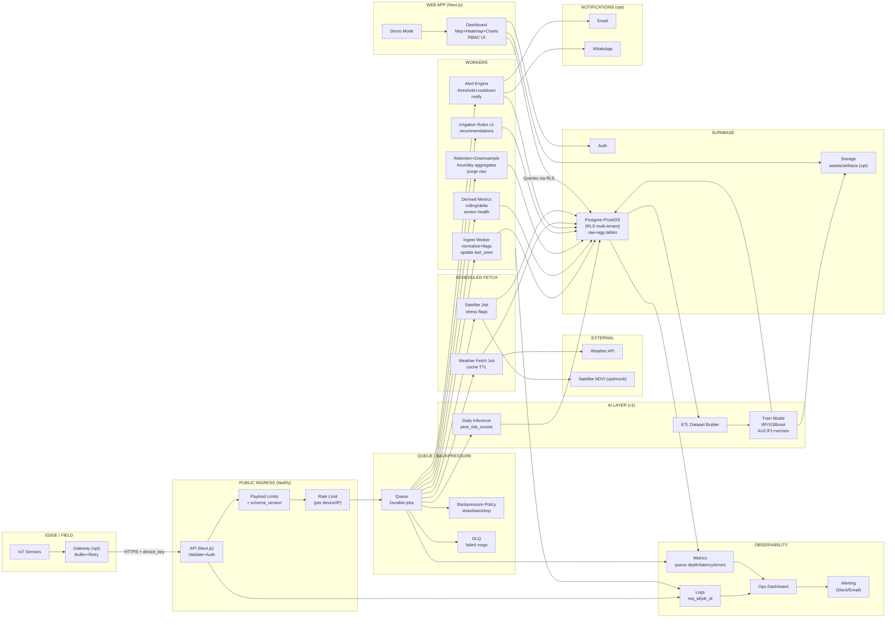

```mermaid
%%{init: {"flowchart": {"nodeSpacing": 50, "rankSpacing": 60}, "theme": "default"} }%%
flowchart LR

  %% ========== EDGE ==========
  subgraph EDGE["EDGE / FIELD"]
    IOT["IoT Sensors"]
    GW["Gateway (opt)\nBuffer+Retry"]
    IOT --> GW
  end

  %% ========== INGRESS ==========
  subgraph ING["PUBLIC INGRESS (Netlify)"]
    API["API (Next.js)\nValidate+Auth"]
    LIM["Rate Limit\n(per device/IP)"]
    SIZE["Payload Limits\n+ schema_version"]
    API --> SIZE --> LIM
  end

  GW -->|HTTPS + device_key| API

  %% ========== QUEUE / BACKPRESSURE ==========
  subgraph QSYS["QUEUE / BACKPRESSURE"]
    Q["Queue\nDurable jobs"]
    BP["Backpressure Policy\nslowdown/drop"]
    DLQ["DLQ\nfailed msgs"]
    Q --> BP
    Q --> DLQ
  end

  LIM --> Q

  %% ========== WORKERS ==========
  subgraph WK["WORKERS"]
    WING["Ingest Worker\nnormalize+flags\nupdate last_seen"]
    WDER["Derived Metrics\nrolling/delta\nsensor health"]
    WRET["Retention+Downsample\nhour/day aggregates\npurge raw"]
    WREC["Irrigation Rules v1\nrecommendations"]
    WALR["Alert Engine\nthreshold+cooldown\nnotify"]
  end

  Q --> WING
  Q --> WDER
  Q --> WRET
  Q --> WREC
  Q --> WALR

  %% ========== DATA (SUPABASE) ==========
  subgraph DATA["SUPABASE"]
    AUTH["Auth"]
    PG["Postgres+PostGIS\n(RLS multi-tenant)\nraw+agg tables"]
    ST["Storage\nassets/artifacts (opt)"]
  end

  WING --> PG
  WDER --> PG
  WRET --> PG
  WREC --> PG
  WALR --> PG

  %% ========== EXTERNAL SOURCES ==========
  subgraph EXT["EXTERNAL"]
    WAPI["Weather API"]
    SAT["Satellite NDVI (opt/mock)"]
  end

  subgraph FETCH["SCHEDULED FETCH"]
    WJOB["Weather Fetch Job\ncache TTL"]
    SJOB["Satellite Job\nstress flags"]
  end

  Q --> WJOB
  Q --> SJOB
  WJOB --> WAPI
  SJOB --> SAT
  WJOB --> PG
  SJOB --> PG

  %% ========== AI ==========
  subgraph AI["AI LAYER (v1)"]
    ETL["ETL Dataset Builder"]
    TRN["Train Model\nRF/XGBoost\nAUC/F1+version"]
    INF["Daily Inference\npest_risk_scores"]
  end

  PG --> ETL --> TRN
  TRN --> ST
  TRN --> PG
  Q --> INF
  INF --> PG

  %% ========== APP / UI ==========
  subgraph UI["WEB APP (Next.js)"]
    WEB["Dashboard\nMap+Heatmap+Charts\nRBAC UI"]
    DEMO["Demo Mode"]
    DEMO --> WEB
  end

  WEB --> AUTH
  WEB -->|Queries via RLS| PG
  WEB --> ST

  %% ========== NOTIFICATIONS ==========
  subgraph NTF["NOTIFICATIONS (opt)"]
    EMAIL["Email"]
    WA["WhatsApp"]
  end

  WALR --> EMAIL
  WALR --> WA

  %% ========== OBSERVABILITY ==========
  subgraph OBS["OBSERVABILITY"]
    LOG["Logs\nreq_id/job_id"]
    MET["Metrics\nqueue depth/latency/errors"]
    ALM["Alerting\n(Slack/Email)"]
    DASH["Ops Dashboard"]
    LOG --> DASH
    MET --> DASH
    DASH --> ALM
  end

  API --> LOG
  Q --> MET
  WK --> LOG
  PG --> MET
```
