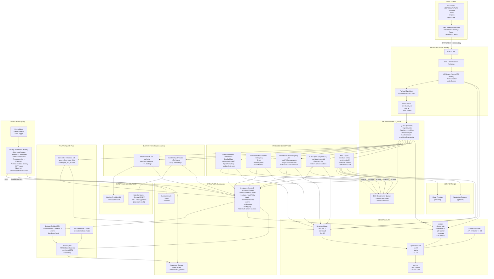

```mermaid
flowchart TB
  %% =========================
  %% NusaAgrix - Technical System Architecture
  %% Includes: Rate Limit, Queue/Backpressure, Retention/Downsampling, Observability
  %% =========================

  %% ---- Edge / Field Layer ----
  subgraph EDGE["EDGE / FIELD"]
    IOT["IoT Sensors (ESP32/LoRa/WiFi)\n- Moisture\n- Temp\n- pH (opt)\n- Heartbeat"]
    GW["Field Gateway (optional)\n- LoRaWAN Gateway / Router\n- Buffering + Retry"]
    IOT --> GW
  end

  %% ---- Public Ingress ----
  subgraph INGRESS["PUBLIC INGRESS (Netlify)"]
    DNS["DNS + TLS"]
    WAF["WAF / Bot Protection (optional)"]
    API["API Layer (Next.js API Routes)\n- Zod Validation\n- Auth Guards"]
    RL["Rate Limiter\n- per device_key\n- per IP\n- burst control"]
    SIZELIM["Payload Size Limits\n+ Schema Version Check"]
    DNS --> WAF --> API
    API --> SIZELIM --> RL
  end

  %% ---- Backpressure / Queue ----
  subgraph QUEUE["BACKPRESSURE / QUEUE"]
    Q["Queue (Durable)\n- Ingest events\n- Weather refresh jobs\n- Inference jobs\nBackpressure: drop/slowdown policy"]
    DLQ["DLQ (Dead Letter Queue)\n- poison messages\n- retries exhausted"]
    RL --> Q
    Q --> DLQ
  end

  %% ---- Processing Services ----
  subgraph PROC["PROCESSING SERVICES"]
    ING["Ingestion Worker\n- Normalize\n- Quality Flags (ok/suspect/invalid)\n- Upsert readings\n- Update last_seen"]
    DER["Derived Metrics Worker\n- rolling avg\n- deltas\n- anomaly rules (stuck/flatline)"]
    AGG["Retention + Downsampling Job\n- hourly/daily aggregates\n- purge raw > retention\n- materialized views refresh"]
    REC["Rule Engine (Irrigation v1)\n- moisture threshold\n- forecast rain\n- write recommendations"]
    ALERT["Alert Engine\n- moisture critical\n- pest threshold\n- cooldown window\n- notification fanout"]
    Q --> ING
    Q --> DER
    Q --> AGG
    Q --> REC
    Q --> ALERT
    ING -->|on error| DLQ
    DER -->|on error| DLQ
    AGG -->|on error| DLQ
    REC -->|on error| DLQ
    ALERT -->|on error| DLQ
  end

  %% ---- Data Layer (Supabase) ----
  subgraph DATA["DATA LAYER (Supabase)"]
    AUTH["Supabase Auth\n- users\n- sessions"]
    PG["Postgres + PostGIS\n- farms/plots/zones\n- sensor_readings (raw)\n- readings_hourly/daily (agg)\n- recommendations\n- events\n- pest scores\n- audit_logs\nRLS: multi-tenant isolation"]
    ST["Supabase Storage\n- farm assets\n- ml artifacts (optional)"]
  end

  ING --> PG
  DER --> PG
  AGG --> PG
  REC --> PG
  ALERT --> PG

  %% ---- External Data Providers ----
  subgraph EXT["EXTERNAL DATA SOURCES"]
    WAPI["Weather Provider API\n- forecast/nowcast"]
    SAT["Satellite Source\n- Sentinel-2 NDVI\n- LST proxy (optional)\n(may start mock)"]
  end

  subgraph FETCH["DATA FETCHERS (Scheduled)"]
    WJOB["Weather Fetch Job\n- cache to weather_forecasts\n- TTL strategy"]
    SATJOB["Satellite Pipeline Job\n- NDVI ingest\n- crop stress flags"]
  end

  Q --> WJOB
  Q --> SATJOB
  WJOB --> WAPI
  SATJOB --> SAT
  WJOB --> PG
  SATJOB --> PG

  %% ---- AI Layer ----
  subgraph AI["AI LAYER (MVP Plus)"]
    ETL["Dataset Builder (ETL)\n- join readings + weather + events\n- time-based split"]
    TRAIN["Training Job\n- RF/XGBoost baseline\n- metrics AUC/F1\n- versioning"]
    INF["Scheduled Inference Job\n- pest risk per zone daily\n- write pest_risk_scores"]
    RETRAIN["Manual Retrain Trigger\n- promote/rollback model"]
  end

  PG --> ETL --> TRAIN --> ST
  TRAIN --> PG
  RETRAIN --> TRAIN
  Q --> INF
  INF --> PG

  %% ---- App / UI ----
  subgraph UI["APPLICATION (Web)"]
    WEB["Next.js Dashboard (Netlify)\n- Map (plots/zones)\n- Heatmap + time slider\n- Time-series charts\n- Recommended vs Executed\n- Pest risk + stress overlay\n- CSV export\nRBAC UI: admin/coop/farmer/viewer"]
    DEMO["Demo Mode\n- demo dataset\n- safe toggle"]
  end

  WEB -->|Auth| AUTH
  WEB -->|Queries via RLS| PG
  WEB --> ST
  DEMO --> WEB

  %% ---- Notifications ----
  subgraph NOTIF["NOTIFICATIONS"]
    EMAIL["Email Provider\n(optional)"]
    WA["WhatsApp Gateway\n(optional)"]
  end
  ALERT --> EMAIL
  ALERT --> WA

  %% ---- Observability ----
  subgraph OBS["OBSERVABILITY"]
    LOGS["Structured Logs\n- request_id\n- device_id\n- job_id"]
    MET["Metrics\n- ingest rate\n- queue depth\n- job latency\n- error rate\n- DB latency"]
    TRACE["Tracing (optional)\n- API -> Worker -> DB"]
    DASH["Ops Dashboard\n- health\n- alerts\n- SLOs"]
    ALM["Alerting\n- Slack/Email\n- on-call rules"]
  end

  API --> LOGS
  ING --> LOGS
  DER --> LOGS
  AGG --> LOGS
  REC --> LOGS
  ALERT --> LOGS
  INF --> LOGS
  Q --> MET
  API --> MET
  PG --> MET
  LOGS --> DASH
  MET --> DASH
  TRACE --> DASH
  DASH --> ALM

  %% ---- Data Flow Return ----
  GW -->|HTTPS POST + device_key| DNS
```
